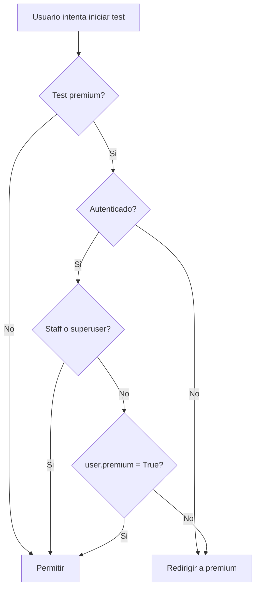

# Sistema de Acceso Premium

[](https://www.djangoproject.com/)
[]()

Sistema de control de acceso premium basado en un único criterio de usuario: `user.premium`.

## Descripción

El acceso a tests premium ahora se valida con tres reglas simples:

1. Si el test no es premium (`instrumento.premium=False`), se permite acceso.
2. Si el usuario es staff/superuser, se permite acceso.
3. Si el test es premium, el usuario debe tener `user.premium=True`.

Ya no se usa un modelo de whitelist por instrumento.

## Requisito en el modelo de usuario

Tu modelo de usuario debe incluir un campo booleano `premium`.

```python
# Ejemplo en tu CustomUser
premium = models.BooleanField(default=False)
```

Si usas un modelo de usuario personalizado, verifica que este campo esté expuesto en el admin para poder activarlo/desactivarlo fácilmente.

## Configuración en settings

Puedes personalizar la URL de redirección para usuarios sin acceso:

### Opción 1: URL directa

```python
TESTS_PRECAVIDOS_PREMIUM_URL = '/premium/'
```

### Opción 2: reverse con kwargs

```python
TESTS_PRECAVIDOS_PREMIUM_URL = {
    'name': 'planes:detalle',
    'kwargs': {'slug': 'premium-anual'},
    'fallback': '/premium/'
}
```

## Flujo de validación



## Código de referencia

La lógica se concentra en `instrumentos/utils.py`:

```python
def user_has_premium_access(user, instrumento):
    if not instrumento.premium:
        return True

    if not user or not user.is_authenticated:
        return False

    if user.is_staff or user.is_superuser or getattr(user, 'is_admin', False):
        return True

    return bool(getattr(user, 'premium', False))
```

## Cómo otorgar acceso premium

### Desde Django Admin

1. Ir a `Admin -> Usuarios`.
2. Editar el usuario.
3. Activar `premium`.
4. Guardar.

### Desde Django shell

```python
from django.contrib.auth import get_user_model

User = get_user_model()

user = User.objects.get(email='usuario@example.com')
user.premium = True
user.save(update_fields=['premium'])
```

## Revocar acceso premium

```python
from django.contrib.auth import get_user_model

User = get_user_model()

user = User.objects.get(email='usuario@example.com')
user.premium = False
user.save(update_fields=['premium'])
```

## Migración desde el esquema anterior

Si venías usando un esquema de whitelist por instrumento, el proyecto ya incluye una migración para eliminarlo:

- `instrumentos/migrations/0004_delete_accesopremiuminstrumento.py`

Aplica migraciones en todos los entornos:

```bash
python manage.py migrate
```

## Troubleshooting

### Error: el usuario no tiene atributo premium

Tu modelo de usuario no tiene el campo `premium`. Debes agregarlo y migrar.

### Usuario premium sigue siendo redirigido

Verifica:

1. `instrumento.premium=True` realmente está marcado.
2. `user.premium=True` en la base de datos.
3. El usuario inició sesión con la cuenta correcta.
4. La URL de redirección en `TESTS_PRECAVIDOS_PREMIUM_URL`.

### Staff no debería ser bloqueado

Por diseño, staff y superuser siempre tienen bypass.
