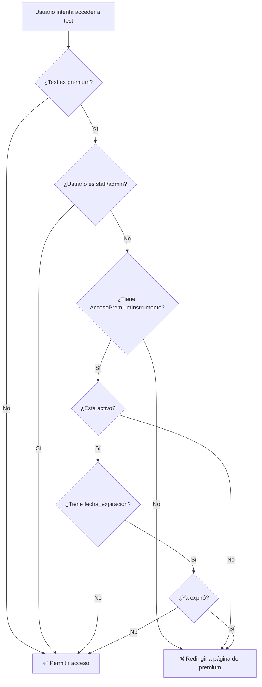

# 💎 Sistema de Acceso Premium

[](https://www.djangoproject.com/)
[]()

> Sistema completo de control de acceso con whitelist de usuarios, fechas de expiración y bypass para staff. Perfecto para ofrecer tests premium de pago o suscripción.

## 📋 Descripción

El sistema premium permite restringir el acceso a ciertos tests psicométricos a usuarios específicos. Incluye:

- ✅ **Whitelist flexible**: Control granular por usuario y test
- ✅ **Fechas de expiración**: Accesos temporales o permanentes
- ✅ **Bypass staff**: Admin y staff siempre tienen acceso
- ✅ **Redirección personalizable**: Envía usuarios a tu página de planes
- ✅ **CRUD completo**: Gestión desde el admin de Django
- ✅ **Badges visuales**: Identificación clara de tests premium

## 🎯 Casos de Uso

### Caso 1: Tests de Pago
```
Usuario compra test premium → Sistema crea AccesoPremiumInstrumento → Usuario puede acceder
```

### Caso 2: Suscripción Mensual
```
Usuario se suscribe → Acceso con fecha_expiracion = 30 días → Renovación automática
```

### Caso 3: Evaluaciones Corporativas
```
Empresa contrata evaluaciones → Se agregan empleados a whitelist → Acceso grupal
```

### Caso 4: Periodo de Prueba
```
Usuario nuevo → Acceso premium 7 días gratis → Expira si no compra
```

## ⚙️ Configuración en Settings

### Opción 1: URL Simple (Mínimo Requerido)

```python
# settings.py

# URL donde redireccionar usuarios sin acceso premium
TESTS_PRECAVIDOS_PREMIUM_URL = '/pricing/'
```

**Resultado:** Usuarios sin acceso son redirigidos a `http://tudominio.com/pricing/`

### Opción 2: URL con Reverse (Avanzado)

```python
# settings.py

TESTS_PRECAVIDOS_PREMIUM_URL = {
    'name': 'tienda:producto',                    # Nombre de la URL en urls.py
    'kwargs': {'slug': 'plan-premium-mensual'},   # Parámetros para reverse()
    'fallback': '/pricing/'                        # URL de respaldo si falla
}
```

**Equivalente a:**
```python
from django.urls import reverse
url = reverse('tienda:producto', kwargs={'slug': 'plan-premium-mensual'})
# Resultado: /tienda/plan-premium-mensual/
```

**Ventajas:**
- No hardcodeas URLs (mejor mantenimiento)
- Compatible con cambios en urls.py
- Flexibilidad para diferentes productos

### Opción 3: Sin Configuración (Default)

```python
# Si no configuras nada, el sistema usa:
TESTS_PRECAVIDOS_PREMIUM_URL = '/premium/'
```

## 🔐 Cómo Funciona el Control de Acceso

### Diagrama de Flujo



### Reglas de Acceso Detalladas

| Test Premium | Usuario | AccesoPremiumInstrumento | Resultado |
|--------------|---------|--------------------------|----------|
| ❌ `False` | Cualquiera | N/A | ✅ **Permitir** |
| ✅ `True` | Staff/Admin | N/A | ✅ **Permitir** (bypass) |
| ✅ `True` | Normal | ❌ No existe | ❌ **Redirigir** |
| ✅ `True` | Normal | ✅ Existe + `activo=False` | ❌ **Redirigir** |
| ✅ `True` | Normal | ✅ Existe + `activo=True` + Sin fecha | ✅ **Permitir** (permanente) |
| ✅ `True` | Normal | ✅ Existe + `activo=True` + Fecha futura | ✅ **Permitir** |
| ✅ `True` | Normal | ✅ Existe + `activo=True` + Fecha pasada | ❌ **Redirigir** (expirado) |

### Código Interno

```python
# applications/instrumentos/utils.py

def user_has_premium_access(usuario, instrumento):
    """
    Verifica si un usuario tiene acceso a un test premium.
    """
    # Bypass 1: Test no es premium
    if not instrumento.premium:
        return True
    
    # Bypass 2: Usuario es staff o admin
    if usuario.is_staff or usuario.is_superuser:
        return True
    
    # Verificar whitelist
    acceso = AccesoPremiumInstrumento.objects.filter(
        usuario=usuario,
        instrumento=instrumento,
        activo=True
    ).first()
    
    if not acceso:
        return False
    
    # Verificar expiración
    return acceso.esta_vigente
```

## 🎛️ Gestión desde el Admin de Django

### Método 1: Por Test (Recomendado para Grant Individual)

```bash
1. Ve a Admin → Instrumentos → [Seleccionar test premium]
2. Scroll hasta sección "Accesos Premium"
3. Click en "Agregar otro Acceso Premium Instrumento"
4. Completar:
   - Usuario: [Seleccionar usuario]
   - Activo: ✓ (marcado)
   - Fecha de expiración: [Dejar vacío para permanente o seleccionar fecha]
5. Click en "Guardar"
```

**✅ Ventajas:**
- Ves todos los accesos de un test específico
- Ideal para gestionar tests corporativos
- Contexto visual inmediato

### Método 2: Vista Global (Recomendado para Gestión Masiva)

```bash
1. Ve a Admin → Accesos Premium a Instrumentos
2. Vista de todos los accesos del sistema
3. Filtros disponibles:
   - Por instrumento
   - Por usuario
   - Por estado de vigencia
4. Acciones en lote:
   - Desactivar seleccionados
   - Eliminar seleccionados
```

**✅ Ventajas:**
- Vista global de todos los accesos
- Filtrado y búsqueda avanzada
- Acciones en lote

### Columnas Visibles en el Admin

| Columna | Descripción | Badge |
|---------|-------------|-------|
| **Usuario** | Nombre del usuario con acceso | - |
| **Instrumento** | Test al que tiene acceso | 💎 (si premium) |
| **Estado** | Activo/Inactivo | 🟢 Vigente / 🔴 Expirado / ⚫ Inactivo |
| **Fecha Expiración** | Cuándo vence el acceso | - |
| **Creado** | Cuándo se otorgó | - |

### Badges de Estado

El admin muestra badges color-coded para identificar rápidamente el estado:

```python
🟢 Vigente       # activo=True + (sin fecha O fecha futura)
🔴 Expirado      # activo=True + fecha pasada
⚫ Inactivo      # activo=False
```

## 💻 Scripts de Python para Automatización

### 1. Otorgar Acceso Premium Permanente

```python
# En Django shell o management command
from applications.instrumentos.models import Instrumento, AccesoPremiumInstrumento
from django.contrib.auth import get_user_model

User = get_user_model()

# Obtener usuario e instrumento
usuario = User.objects.get(username='juan')
test = Instrumento.objects.get(slug='test-premium-liderazgo')

# Crear acceso permanente
acceso, created = AccesoPremiumInstrumento.objects.get_or_create(
    usuario=usuario,
    instrumento=test,
    defaults={'activo': True, 'fecha_expiracion': None}
)

if created:
    print(f"✅ Acceso otorgado a {usuario.username}")
else:
    print(f"ℹ️ {usuario.username} ya tenía acceso")
```

### 2. Otorgar Acceso con Expiración

```python
from datetime import datetime, timedelta
from applications.instrumentos.models import AccesoPremiumInstrumento
from django.contrib.auth import get_user_model

User = get_user_model()

# Acceso por 30 días
usuario = User.objects.get(email='usuario@example.com')
test = Instrumento.objects.get(slug='competencias-ejecutivas')

AccesoPremiumInstrumento.objects.create(
    usuario=usuario,
    instrumento=test,
    activo=True,
    fecha_expiracion=datetime.now() + timedelta(days=30)
)

print(f"✅ Acceso otorgado hasta {acceso.fecha_expiracion.strftime('%d/%m/%Y')}")
```

### 3. Otorgar Acceso Masivo (Lista de Usuarios)

```python
from applications.instrumentos.models import Instrumento, AccesoPremiumInstrumento
from django.contrib.auth import get_user_model
from datetime import datetime, timedelta

User = get_user_model()

# Lista de emails de una empresa
emails_corporativos = [
    'empleado1@empresa.com',
    'empleado2@empresa.com',
    'empleado3@empresa.com',
]

test = Instrumento.objects.get(slug='evaluacion-corporativa-2026')
fecha_expiracion = datetime.now() + timedelta(days=90)  # 90 días

accesos_creados = []
for email in emails_corporativos:
    try:
        usuario = User.objects.get(email=email)
        acceso, created = AccesoPremiumInstrumento.objects.get_or_create(
            usuario=usuario,
            instrumento=test,
            defaults={
                'activo': True,
                'fecha_expiracion': fecha_expiracion
            }
        )
        if created:
            accesos_creados.append(email)
    except User.DoesNotExist:
        print(f"⚠️ Usuario no encontrado: {email}")

print(f"\n✅ Accesos otorgados: {len(accesos_creados)}")
print(f"📅 Vigencia hasta: {fecha_expiracion.strftime('%d/%m/%Y')}")
```

### 4. Desactivar Acceso Premium

```python
# Opción 1: Desactivar (mantiene registro histórico)
acceso = AccesoPremiumInstrumento.objects.get(
    usuario__username='juan',
    instrumento__slug='test-premium'
)
acceso.activo = False
acceso.save()
print("✅ Acceso desactivado")

# Opción 2: Eliminar completamente
acceso.delete()
print("✅ Acceso eliminado")
```

### 5. Renovar Acceso Expirado

```python
from datetime import datetime, timedelta

# Extender 30 días más desde hoy
acceso = AccesoPremiumInstrumento.objects.get(
    usuario__email='usuario@example.com',
    instrumento__slug='test-premium'
)

# Opción 1: Extender desde hoy
acceso.fecha_expiracion = datetime.now() + timedelta(days=30)
acceso.activo = True
acceso.save()

# Opción 2: Hacer permanente
acceso.fecha_expiracion = None
acceso.activo = True
acceso.save()

print(f"✅ Acceso renovado para {acceso.usuario.username}")
```

### 6. Consultar Accesos Vigentes

```python
from applications.instrumentos.models import AccesoPremiumInstrumento
from django.utils import timezone

# Todos los accesos vigentes de un test
test = Instrumento.objects.get(slug='test-premium')
vigentes = AccesoPremiumInstrumento.objects.filter(
    instrumento=test,
    activo=True
).filter(
    Q(fecha_expiracion__isnull=True) |  # Sin fecha (permanente)
    Q(fecha_expiracion__gt=timezone.now())  # Fecha futura
)

print(f"Accesos vigentes para '{test.nombre}': {vigentes.count()}")
for acceso in vigentes:
    if acceso.fecha_expiracion:
        print(f"  - {acceso.usuario.username} (expira {acceso.fecha_expiracion.strftime('%d/%m/%Y')})")
    else:
        print(f"  - {acceso.usuario.username} (permanente)")
```

### 7. Accesos a Punto de Expirar (Enviar Recordatorio)

```python
from datetime import datetime, timedelta
from applications.instrumentos.models import AccesoPremiumInstrumento

# Buscar accesos que expiran en los próximos 7 días
hoy = datetime.now()
en_7_dias = hoy + timedelta(days=7)

proximos_a_expirar = AccesoPremiumInstrumento.objects.filter(
    activo=True,
    fecha_expiracion__gte=hoy,
    fecha_expiracion__lte=en_7_dias
)

print(f"⚠️ {proximos_a_expirar.count()} accesos expiran en los próximos 7 días:")
for acceso in proximos_a_expirar:
    dias_restantes = (acceso.fecha_expiracion - hoy).days
    print(f"  - {acceso.usuario.email}: {acceso.instrumento.nombre} ({dias_restantes} días)")
    
    # Aquí puedes enviar email de recordatorio
    # send_email_renovacion(acceso.usuario.email, acceso.instrumento, dias_restantes)
```

## 🔌 API de Utilidades (utils.py)

El sistema incluye funciones helper en `applications/instrumentos/utils.py`:

### `get_premium_url()`

Obtiene la URL configurada para redirección premium.

```python
from applications.instrumentos.utils import get_premium_url

url = get_premium_url()
# Retorna: '/pricing/' o resultado de reverse()
```

### `user_has_premium_access(usuario, instrumento)`

Verifica si un usuario tiene acceso (bool).

```python
from applications.instrumentos.utils import user_has_premium_access

if user_has_premium_access(request.user, instrumento):
    # Usuario tiene acceso
    pass
else:
    # Usuario no tiene acceso
    pass
```

### `check_premium_access(usuario, instrumento)`

Retorna `None` si tiene acceso o `HttpResponseRedirect` si no.

```python
from applications.instrumentos.utils import check_premium_access

# En una vista
redirect = check_premium_access(request.user, instrumento)
if redirect:
    return redirect  # Redirige automáticamente
# Si llega aquí, tiene acceso
```

### `redirect_to_premium()`

Redirige directamente a la URL premium.

```python
from applications.instrumentos.utils import redirect_to_premium

# En caso de acceso denegado
return redirect_to_premium()
```

## 🎓 Ejemplos de Integración

### Ejemplo 1: Vista Personalizada con Premium

```python
from django.shortcuts import render, get_object_or_404
from django.contrib.auth.decorators import login_required
from applications.instrumentos.models import Instrumento
from applications.instrumentos.utils import check_premium_access

@login_required
def mi_vista_personalizada(request, slug):
    instrumento = get_object_or_404(Instrumento, slug=slug)
    
    # Verificar acceso premium
    redirect = check_premium_access(request.user, instrumento)
    if redirect:
        messages.warning(request, f'El test "{instrumento.nombre}" requiere acceso premium.')
        return redirect
    
    # Usuario tiene acceso, continuar con lógica
    context = {'instrumento': instrumento}
    return render(request, 'mi_template.html', context)
```

### Ejemplo 2: Webhook de Pago (Stripe/PayPal)

```python
from datetime import datetime, timedelta
from applications.instrumentos.models import Instrumento, AccesoPremiumInstrumento
from django.contrib.auth import get_user_model

User = get_user_model()

def webhook_pago_exitoso(data):
    """
    Se ejecuta cuando un usuario completa un pago.
    """
    email = data.get('customer_email')
    plan = data.get('plan')  # 'mensual', 'anual', etc.
    
    usuario = User.objects.get(email=email)
    
    # Obtener todos los tests premium
    tests_premium = Instrumento.objects.filter(premium=True)
    
    # Determinar duración según plan
    if plan == 'mensual':
        dias = 30
    elif plan == 'anual':
        dias = 365
    else:
        dias = 7  # Prueba gratuita
    
    fecha_expiracion = datetime.now() + timedelta(days=dias)
    
    # Otorgar acceso a todos los tests premium
    for test in tests_premium:
        AccesoPremiumInstrumento.objects.update_or_create(
            usuario=usuario,
            instrumento=test,
            defaults={
                'activo': True,
                'fecha_expiracion': fecha_expiracion
            }
        )
    
    print(f"✅ Acceso premium otorgado a {email} hasta {fecha_expiracion}")
```

### Ejemplo 3: Management Command para Limpiar Expirados

```python
# management/commands/limpiar_accesos_expirados.py

from django.core.management.base import BaseCommand
from datetime import datetime
from applications.instrumentos.models import AccesoPremiumInstrumento

class Command(BaseCommand):
    help = 'Desactiva accesos premium expirados'
    
    def handle(self, *args, **options):
        hoy = datetime.now()
        
        expirados = AccesoPremiumInstrumento.objects.filter(
            activo=True,
            fecha_expiracion__lt=hoy
        )
        
        count = expirados.count()
        expirados.update(activo=False)
        
        self.stdout.write(
            self.style.SUCCESS(f'✅ {count} accesos desactivados por expiración')
        )
```

**Ejecutar:**
```bash
python manage.py limpiar_accesos_expirados
```

**Automatizar con cron:**
```bash
# Ejecutar diariamente a las 00:00
0 0 * * * /path/to/python /path/to/manage.py limpiar_accesos_expirados
```

## 🧪 Testing del Sistema Premium

### Test Manual

```bash
1. Crea un test premium:
   Admin → Instrumentos → Agregar
   - Marca "Premium" = ✓
   
2. Crea usuario de prueba (no staff):
   Admin → Usuarios → Agregar
   
3. Intenta acceder al test sin acceso:
   - Login como usuario no-staff
   - Ve a /evaluaciones/test-premium/
   - Deberías ser redirigido a /pricing/
   
4. Otorga acceso:
   Admin → Accesos Premium → Agregar
   - Usuario: [test user]
   - Instrumento: [test premium]
   - Guardar
   
5. Intenta de nuevo:
   - Ahora deberías poder acceder
```

### Test con Expiración

```bash
1. Crea acceso con fecha de ayer:
   fecha_expiracion = datetime.now() - timedelta(days=1)
   
2. Intenta acceder:
   - Deberías ser redirigido (expirado)
   
3. Extiende la fecha a mañana:
   fecha_expiracion = datetime.now() + timedelta(days=1)
   
4. Intenta de nuevo:
   - Ahora deberías poder acceder
```

## 📊 Reporting y Analytics

### Dashboard de Accesos Premium

```python
from applications.instrumentos.models import AccesoPremiumInstrumento, Instrumento
from django.db.models import Count
from datetime import datetime

# Total de accesos vigentes
vigentes = AccesoPremiumInstrumento.objects.filter(
    activo=True,
    fecha_expiracion__gte=datetime.now()
).count()

# Accesos por instrumento
por_test = AccesoPremiumInstrumento.objects.filter(
    activo=True
).values(
    'instrumento__nombre'
).annotate(
    total=Count('id')
).order_by('-total')

# Accesos que expiran este mes
from datetime import datetime, timedelta
inicio_mes = datetime.now().replace(day=1)
fin_mes = (inicio_mes + timedelta(days=32)).replace(day=1)

expiraciones_mes = AccesoPremiumInstrumento.objects.filter(
    activo=True,
    fecha_expiracion__gte=inicio_mes,
    fecha_expiracion__lt=fin_mes
).count()

print(f"Accesos vigentes: {vigentes}")
print(f"Expiran este mes: {expiraciones_mes}")
```

## 🔗 Referencias

- **[README Principal](README.md)**: Documentación completa del sistema
- **[README_IMPORTACION.md](README_IMPORTACION.md)**: Importación de tests
- **[README_RETROALIMENTACION.md](README_RETROALIMENTACION.md)**: Sistema de diagnósticos

## ✅ Checklist de Implementación

```
[ ] Configurar TESTS_PRECAVIDOS_PREMIUM_URL en settings.py
[ ] Crear página de pricing/planes en tu proyecto
[ ] Marcar tests como premium=True
[ ] Probar flujo de redirección sin acceso
[ ] Implementar webhook de pago (si aplica)
[ ] Crear management command de limpieza (opcional)
[ ] Configurar cron para limpieza automática (opcional)
[ ] Documentar proceso para tu equipo
[ ] Probar con usuarios reales
```

---

<div align="center">

**¿Dudas sobre el sistema premium?** Abre un [issue en GitHub](https://github.com/juanbacan/Quierosermaestro/issues)

⭐ **Sistema completo de monetización integrado** ⭐

Sin necesidad de plugins externos ni suscripciones adicionales

</div>
